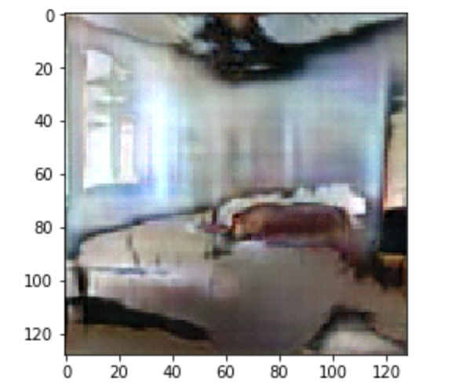
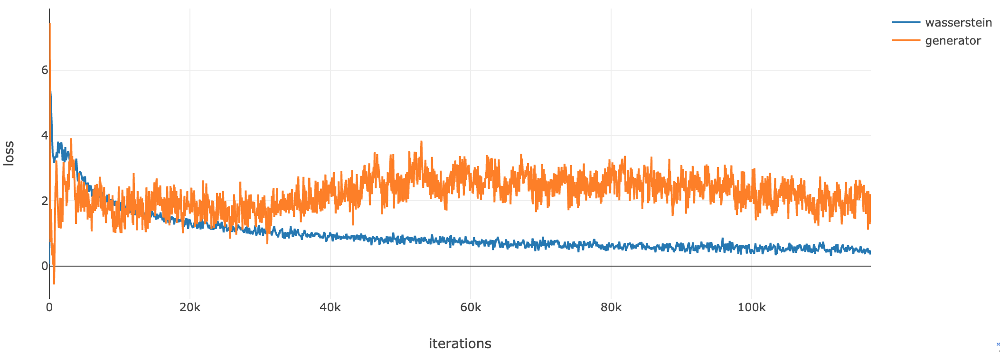

# Wasserstein GAN

This is a simple implementation of the Wasserstein GAN from Arjovsky et al,
(https://arxiv.org/pdf/1701.07875.pdf). Pretrained weights are included for the
LSUN bedroom dataset and the MNIST digits dataset. Other datasets can be used
with the --path flag. 

## Training

The model can be trained using a given dataset passed to the script with the
--path [path to dataset] flag. The following options are supported:

--path: path to the training data

--lr: learning rate for RMSProp optimizer

--batch_size: training batch size

--epochs: number of epochs to run

--noise_size: size of the latent noise vector

--critic_steps: the number of discriminator optimizer steps per generator step

--cutoff: gradient cutoff for WGAN clipping (not used by default)

--image_size: image size to use. larger images will be resized.

--dataset: name of model to use. mnist and lsun models are provided.

--plot: whether to plot generator results after each epoch.

--visdom: should use visdom to plot training progress (default False)

--visdom_port: port for visdom to use.

The following is the training curve for the MNIST dataset:

